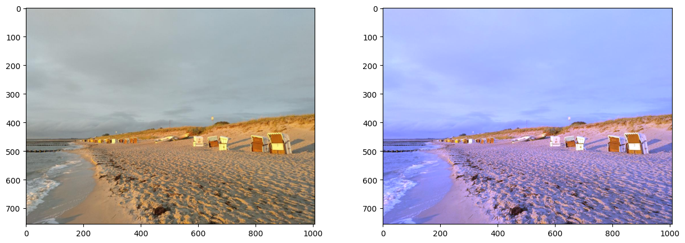
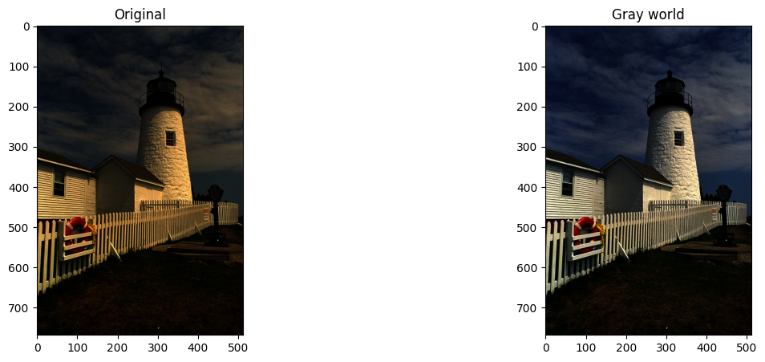
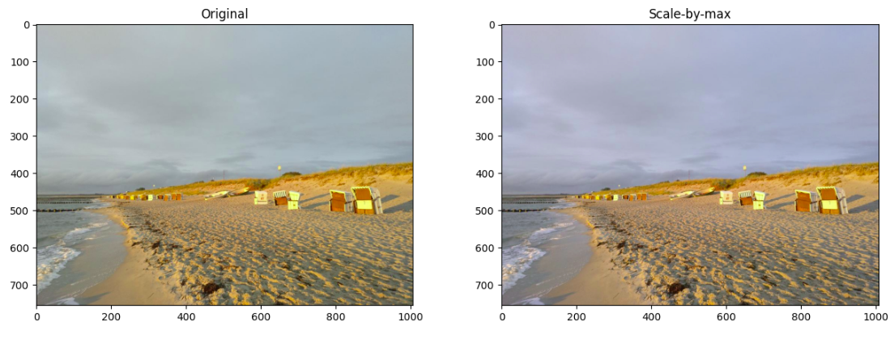

# Computer vision homeworks

## Lesson 2

[Jupyther notebook](lesson-2/homework/Homework.ipynb)

Implemented color balancing algorithms:

- **White patch**
  
- **Gray world**
  
- **Scale-by-max**
  
  > This image is not suitable for this algorithm because only the blue channel changes slightly, and the overall appearance of the image remains almost the same.
