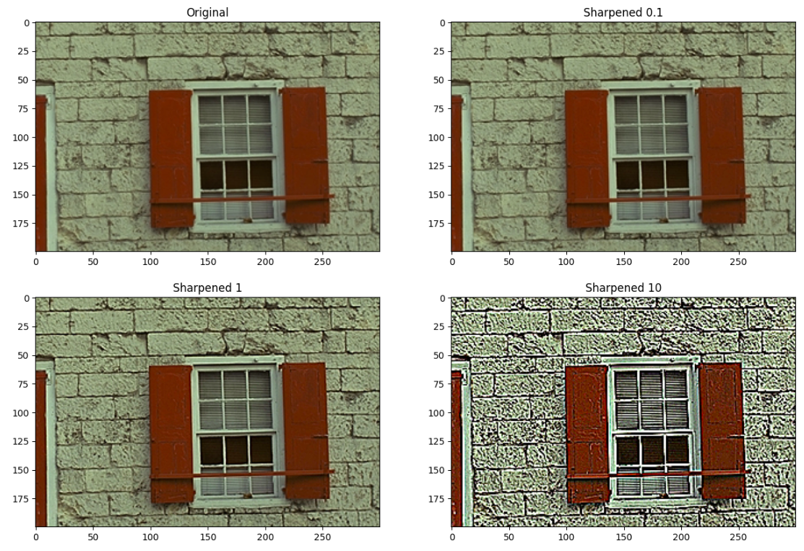
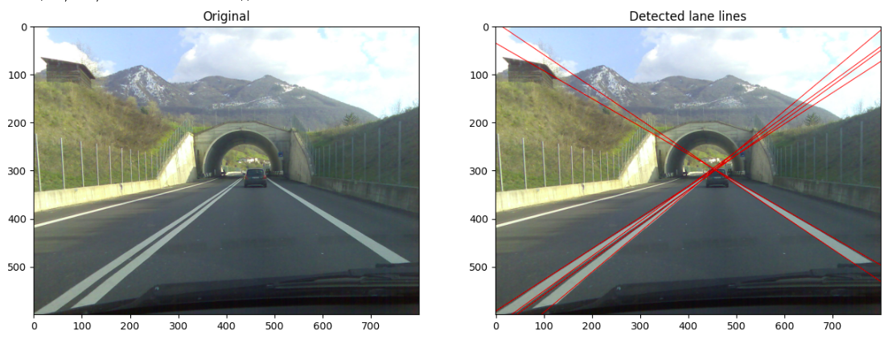
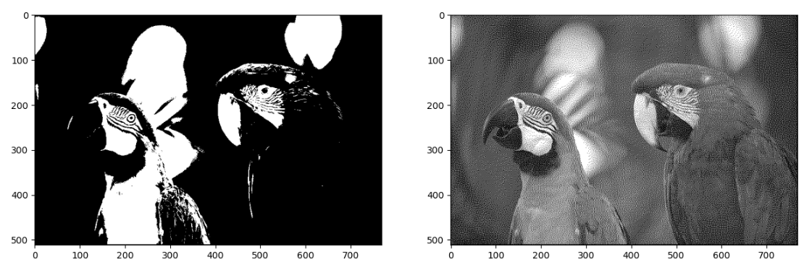
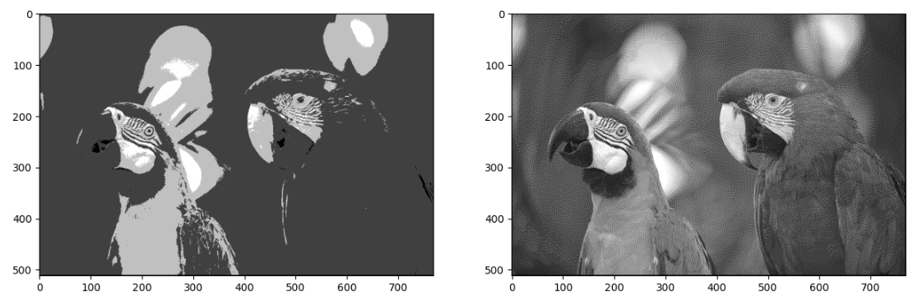
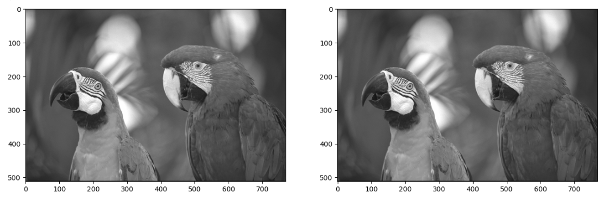
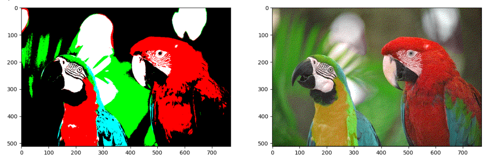

# Computer vision homeworks

## Lesson 2

[Jupyther notebook](lesson-2/homework/Homework.ipynb)

Implemented color balancing algorithms:

- **White patch**
  
- **Gray world**
  
- **Scale-by-max**
  
  > This image is not suitable for this algorithm because only the blue channel changes slightly, and the overall appearance of the image remains almost the same.

## Lesson 3

[Jupyther notebook](lesson-3/homework/Homework.ipynb)

Implemented unsharp masking with gaussian blur:

## Lesson 4

[Jupyther notebook](lesson-4/homework/Homework.ipynb)

Detect lane lines:

## Lesson 5

[Jupyther notebook](lesson-5/homework/Homework.ipynb)

Image quantization with different color paliters:

Original image:

Left image is optimally quantized, right is with Floyd-Steinberg Dithering

- **2 gray tone colors**

- **4 gray tone colors**

- **16 gray tone colors**

- **256 gray tone colors**

- **5 pure colors** (black, white, red, green, blue)

