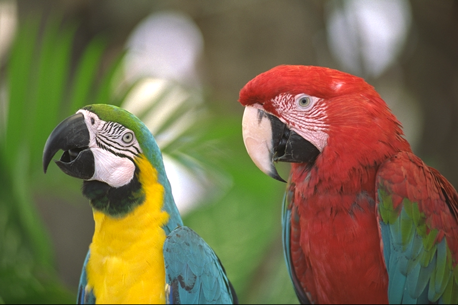
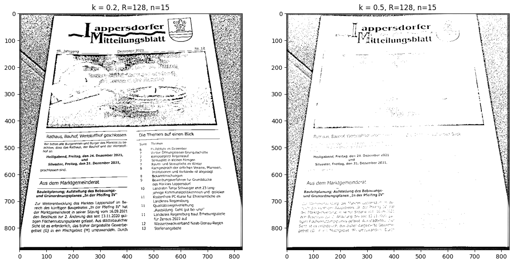

# Computer vision homeworks

## Lesson 2

[Jupyther notebook](lesson-2/homework/Homework.ipynb)

Implemented color balancing algorithms:

- **White patch**
  
- **Gray world**
  
- **Scale-by-max**
  
  > This image is not suitable for this algorithm because only the blue channel changes slightly, and the overall appearance of the image remains almost the same.

## Lesson 3

[Jupyther notebook](lesson-3/homework/Homework.ipynb)

Implemented unsharp masking with gaussian blur:

## Lesson 4

[Jupyther notebook](lesson-4/homework/Homework.ipynb)

Detect lane lines:

## Lesson 5

[Jupyther notebook](lesson-5/homework/Homework.ipynb)

Image quantization with different color paliters:

Original image:

Left image is optimally quantized, right is with Floyd-Steinberg Dithering

- **2 gray tone colors**

- **4 gray tone colors**

- **16 gray tone colors**

- **256 gray tone colors**

- **5 pure colors** (black, white, red, green, blue)

If you enlarge the image, you can see that there are actually 5 colors (left - original, right - quantized).

## Lesson 6

[Jupyther notebook](lesson-6/homework/Homework.ipynb)

Using the Harris corner detector to detect the corners of a document.

Original image:

At first find all corners, than filter it to keep only document corners.

## Lesson 7

[Jupyther notebook](lesson-7/homework/Homework.ipynb)

Use perspective transform to rectify document image:

## Lesson 8

[Jupyther notebook](lesson-8/homework/Homework.ipynb)

**Otsu’s Thresholding** to separate document text from background:

The result is not very good, because this image is not suitable for Otsu’s Thresholding. There is more than two clusters of pixels. One of the reasons is uneven lightning of the image.

So instead of Otsu’s Thresholding we should use more advanced methods, like [Sauvola Thresholding](https://wahabaftab.com/Sauvola-Thresholding-Integral-Images/) which calculate threshold for each pixel instead of one global threshold, or K-means.

**Sauvola Thresholding**

Sauvola threshold with k=0.2 and n=15 still not perfect, but better than Otsu’s Thresholding. And I think that if you experiment, you can choose more optimal coefficients to get better results with Sauvola Thresholding.
